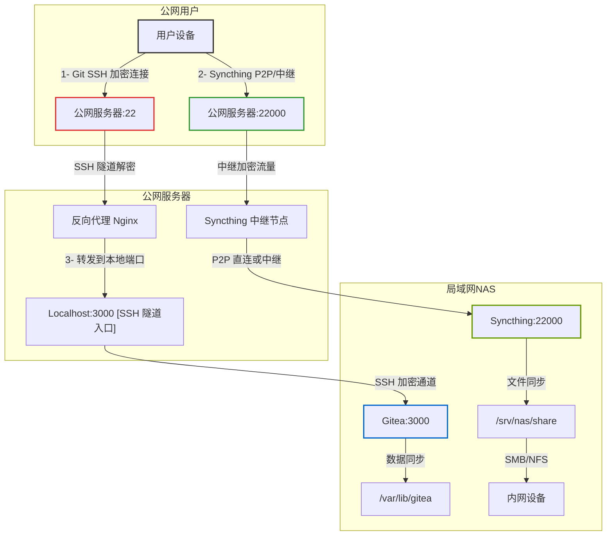

<!-- TOC -->

- [1. 流程](#1-流程)
- [2. diyNAS](#2-diynas)
    - [2.1. Linux](#21-linux)
    - [2.2. Samba](#22-samba)
    - [2.3. Syching](#23-syching)
    - [2.4. Nginx](#24-nginx)
    - [2.5. Gitea](#25-gitea)
    - [2.6. Frp](#26-frp)
- [3. docs](#3-docs)

<!-- /TOC -->
# 1. 流程

# 2. diyNAS
DIY NAS with Linux Samba Syncthing Nginx Gitea Frp
## 2.1. Linux

## 2.2. Samba

## 2.3. Syching

## 2.4. Nginx

## 2.5. Gitea 

## 2.6. Frp

# 3. docs